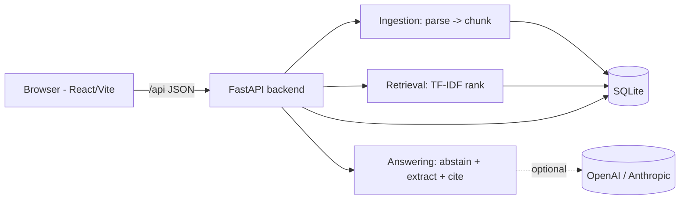
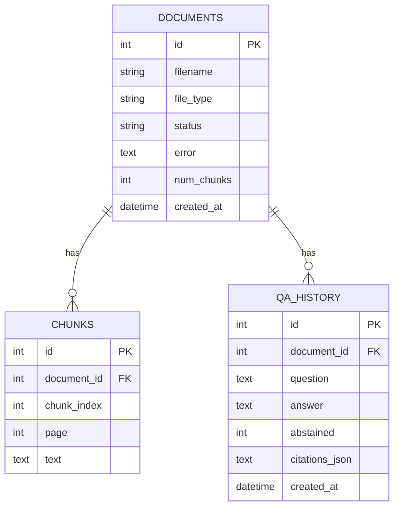
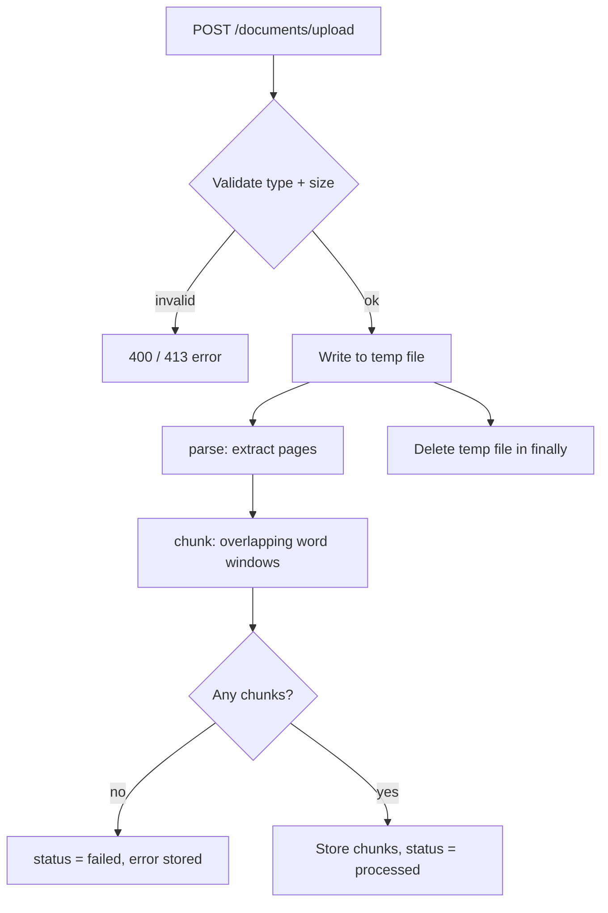
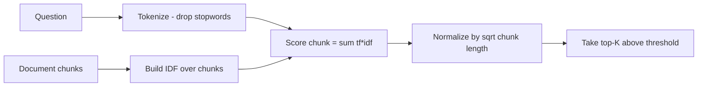
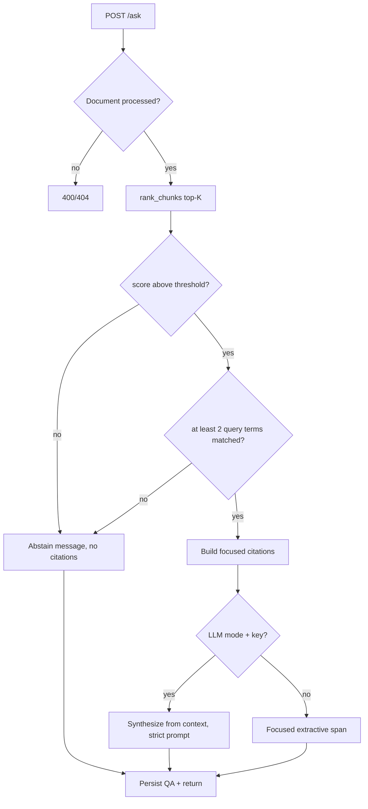
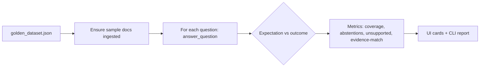

# Architecture — FinanceFlow AI

## System overview

A two-tier app: a React/Vite single-page frontend talks to a FastAPI backend over
a small REST/JSON API. The backend parses documents into chunks, ranks them with a
TF-IDF retriever, builds a grounded answer with citations, and persists everything
in SQLite. No external services are required to run it.

In Docker, the frontend is served by nginx which proxies `/api` to the backend
container; in local dev, Vite proxies `/api` to `http://127.0.0.1:8000`.

## Backend modules (`backend/app/`)

| Module | Responsibility |
| ------ | -------------- |
| `main.py` | FastAPI app, all endpoints, CORS, logging setup, global exception handler |
| `config.py` | Env-driven settings with safe defaults (answer mode, thresholds, limits) |
| `database.py` | SQLAlchemy engine/session + SQLite `PRAGMA foreign_keys=ON` |
| `models.py` | ORM models: `Document`, `Chunk`, `QA` |
| `schemas.py` | Pydantic request/response models (typed I/O, Swagger) |
| `parsing.py` | Text extraction: TXT (whole file) and PDF (per page, via `pypdf`) |
| `chunking.py` | Overlapping word-window chunking |
| `retrieval.py` | Tokenizer + TF-IDF ranker (`rank_chunks`) — offline first stage |
| `reranking.py` | Optional cross-encoder reranking (FlashRank) of the TF-IDF candidates; graceful fallback to TF-IDF order when unavailable |
| `answering.py` | Abstention gates, focused extractive answer, citation builder |
| `llm.py` | Optional OpenAI/Anthropic synthesis with graceful fallback |
| `ingest.py` | Shared parse → chunk → persist pipeline |
| `evaluation.py` | Golden-dataset runner + metrics |
| `eval_cli.py` | `python -m app.eval_cli` |
| `reset_db.py` | `python -m app.reset_db` (drop + recreate) |
| `logging_config.py` | One-line logging setup |

## Frontend modules (`frontend/src/`)

| Area | Files |
| ---- | ----- |
| Shell | `App.jsx` (sidebar + view routing + demo orchestration) |
| Navigation | `components/Sidebar.jsx` |
| Views | `components/views/Overview.jsx`, `Ask.jsx`, `Evaluation.jsx` |
| Feature components | `DocumentCard.jsx`, `EvidencePanel.jsx`, `MetricCard.jsx`, `Upload.jsx` |
| UI primitives | `components/ui/Button.jsx`, `Card.jsx`, `Badge.jsx`, `Field.jsx`, `States.jsx` |
| Misc | `lib/icons.jsx`, `api.js`, `styles.css` |

## Database schema

Deleting a `Document` cascades to its `Chunk` and `QA` rows (ORM cascade +
SQLite foreign-key pragma).

## Document processing flow

The raw upload is parsed in a temp file and then discarded — only extracted
chunks are persisted.

## Retrieval flow

## Ask → answer → citation flow

## Evaluation flow

`unsupported_answer_count > 0` makes the CLI exit non-zero, so CI can gate on it.
